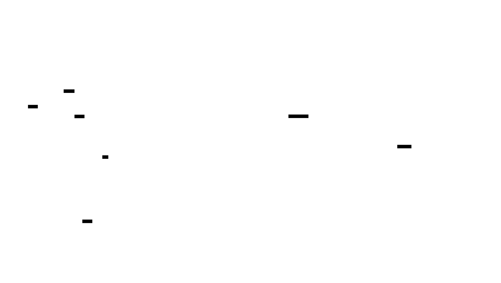

# Architecture

## Thread-Per-Core vs Work-Stealing


GMF uses a **shared-nothing, thread-per-core** architecture. Each physical CPU core runs its own independent event loop with:

- Its own TCP listener (via `SO_REUSEPORT` on Linux)
- Its own connection pool and semaphore
- No shared mutable state between cores (except an `AtomicBool` shutdown flag)
- CPU pinning for cache locality (Linux)

### Why shared-nothing wins

Traditional async runtimes like tokio use a **work-stealing scheduler**: a shared task queue feeds N worker threads, and idle workers steal tasks from busy ones. This requires:

- **Atomic operations** on every task enqueue/dequeue (the shared run queue)
- **`Arc<Mutex<...>>`** for any shared state across tasks
- **`Send + Sync` bounds** on all futures, preventing single-threaded optimizations
- **Cross-thread cache invalidation** when a stolen task runs on a different core

GMF eliminates all of this. Each core is a fully independent server instance:

```
Core 0: TcpListener → accept → semaphore → HTTP/2 → tonic handler
Core 1: TcpListener → accept → semaphore → HTTP/2 → tonic handler
Core 2: TcpListener → accept → semaphore → HTTP/2 → tonic handler
```

Because each core is single-threaded, GMF uses `Rc<Cell<usize>>` for the connection semaphore instead of `Arc<AtomicUsize>` — no atomic operations, no cache-line bouncing. This is visible in `monoio_runtime.rs:128-148` where `MonoioSemaphore` uses `Rc<Cell<usize>>`.

The kernel's `SO_REUSEPORT` option distributes incoming connections across the per-core listeners. No userspace load balancing is needed.

### Scaling characteristics

Work-stealing throughput plateaus as core count increases — the shared run queue becomes a bottleneck. GMF scales near-linearly because each core operates independently. The only shared state is the `AtomicBool` shutdown flag, which is read (not written) on the hot path.

## io_uring Deep Dive



### The syscall problem

With epoll (tokio's backend on Linux), every IO operation requires a separate syscall:

1. `epoll_wait()` — check which file descriptors are ready
2. `read(fd, buf, len)` — read data from a ready fd
3. `write(fd, buf, len)` — write response data
4. Back to `epoll_wait()`

Each syscall is a user-to-kernel context switch: save registers, switch to kernel stack, execute, switch back. At high request rates, syscall overhead becomes the bottleneck.

### How io_uring works

io_uring (Linux 5.6+) uses two shared-memory ring buffers between userspace and kernel:

- **Submission Queue (SQ)**: Userspace writes Submission Queue Entries (SQEs) describing IO operations (read, write, accept, etc.)
- **Completion Queue (CQ)**: Kernel writes Completion Queue Entries (CQEs) with results

The key insight: userspace can batch N operations into the SQ, then make a single `io_uring_enter()` syscall to submit them all. The kernel processes them and writes completions to the CQ. **N operations = 1 syscall** (vs N syscalls with epoll).

With `SQPOLL` mode, a kernel thread continuously polls the SQ — achieving **zero syscalls** for sustained IO.

### monoio's FusionDriver

monoio uses a `FusionDriver` that selects the best IO backend at runtime:

- **Linux**: io_uring (with fallback to epoll if io_uring is unavailable)
- **macOS**: kqueue (completion-based, similar model to io_uring)

The io_uring advantage is most pronounced under high concurrency where syscall batching amortizes overhead across hundreds of concurrent operations.

### The compatibility layer

hyper requires poll-based IO (`tokio::io::AsyncRead`/`AsyncWrite`), but monoio's IO is completion-based. The `monoio-compat` crate bridges this gap:

1. `StreamWrapper` wraps monoio's `TcpStream` to provide poll-based semantics
2. `MonoioIo` adapts to `hyper::rt::Read` + `hyper::rt::Write`

This introduces a copy at the HTTP layer — the performance advantage comes from thread-per-core scheduling, not zero-copy IO. See `monoio_runtime.rs:92-101` for the bridge.

## CPU Pinning & Cache Locality


### The migration problem

Without CPU pinning, the OS scheduler freely migrates threads between cores. When a thread moves from Core 0 to Core 1:

- Core 1's L1 cache (32-64 KB) has none of the thread's data — **cold start**
- Core 1's L2 cache (256 KB-1 MB) is also cold
- Every memory access becomes an L3 hit (~10ns) or main memory fetch (~100ns) instead of L1 (~1ns)
- Core 0's warm cache is now wasted

For a gRPC server processing thousands of requests per second, each connection's state (HTTP/2 frame buffers, protobuf decode buffers, handler state) must be re-fetched into cache after every migration.

### How GMF pins threads

In `monoio_runtime.rs:35-46`, GMF pins each thread to a specific CPU core using `sched_setaffinity`:

```rust
#[cfg(target_os = "linux")]
{
    unsafe {
        let mut cpuset: libc::cpu_set_t = std::mem::zeroed();
        libc::CPU_SET(cpu, &mut cpuset);
        libc::sched_setaffinity(0, size_of::<libc::cpu_set_t>(), &cpuset);
    }
}
```

This ensures:
- Thread 0 always runs on Core 0, Thread 1 on Core 1, etc.
- Connection state stays in L1/L2 cache across requests on the same connection
- The event loop's internal state (ring buffers, timer heaps) never migrates

### NUMA considerations

On multi-socket servers (NUMA), CPU pinning also ensures memory locality. Each NUMA node has local memory with ~100ns access time vs ~300ns for remote memory. Pinning threads to cores on the same NUMA node as their allocated memory avoids cross-node traffic.

## SO_REUSEPORT

`SO_REUSEPORT` (Linux 3.9+) allows multiple sockets to bind to the same address and port. The kernel distributes incoming connections across them using a hash of the source IP and port.

### How GMF uses it

Each core creates its own `TcpListener` bound to the same `addr` (e.g., `0.0.0.0:50051`). The `SO_REUSEPORT` socket option is set by monoio/glommio automatically. The kernel distributes connections without any userspace coordination.

This is superior to the traditional pattern of one listener that accepts connections and dispatches them to worker threads, because:

1. **No accept mutex**: Multiple threads calling `accept()` on the same socket creates thundering-herd contention. `SO_REUSEPORT` eliminates this.
2. **Kernel-level load balancing**: The hash-based distribution is extremely fast (done in the kernel's TCP stack).
3. **Connection locality**: A connection always stays on the core that accepted it — no hand-off needed.

### Future: BPF-based steering

Linux supports `BPF_PROG_TYPE_SK_REUSEPORT` programs for custom connection steering. This could enable affinity-based routing (e.g., steering connections from the same client to the same core) for even better cache utilization.

## Request Lifecycle


A gRPC request flows through the following path (referencing `gmf_server.rs`):

1. **Client sends TCP SYN** to `:50051`
2. **Kernel `SO_REUSEPORT`** hashes source IP:port → selects Core N's listener
3. **`accept_loop()`** (`gmf_server.rs:237-270`) — Core N's `RuntimeTcpListener::accept()` returns the stream
4. **Semaphore check** (`gmf_server.rs:251-255`) — `try_acquire()` gates connection count. Uses `Rc<Cell<usize>>` (monoio) — no atomics
5. **IO bridge** (`monoio_runtime.rs:97-99`) — `stream.into_hyper_io()` wraps the monoio `TcpStream` in `StreamWrapper` + `MonoioIo` for hyper compatibility
6. **HTTP/2 serving** (`gmf_server.rs:264`) — `hyper::server::conn::http2::Builder::new(exec).serve_connection(io, svc)` handles HTTP/2 framing, HPACK header compression, and stream multiplexing
7. **Service adaptation** (`gmf_server.rs:150-154`) — `TowerToHyperService::call()` clones the inner tower `Service` and calls it with `&mut self` (tower's interface) from hyper's `&self` interface
8. **tonic handler** — the user's gRPC service implementation processes the request and returns a protobuf-encoded response
9. **Response** flows back through hyper → HTTP/2 DATA frames → TCP → client

The entire path from accept to response runs on a single core with no thread hops, no channel sends, and no lock acquisitions.

## IO Model

The performance advantage comes from the **thread-per-core scheduling model**, not from zero-copy IO at the HTTP layer.

- **monoio**: Uses io_uring (Linux) or kqueue (macOS) for completion-based IO at the kernel level. However, hyper requires poll-based IO, so `monoio-compat` introduces a copy at the HTTP layer.
- **glommio**: Similar to monoio — io_uring-backed, with a `HyperIo` bridge from `futures_lite` traits to `hyper::rt` traits.
- **tokio**: Standard poll-based IO via `TokioIo` from `hyper-util`.

All three runtimes share the same accept loop and HTTP/2 serving logic via the `Runtime` trait abstraction.

## Runtime Trait System

The core abstraction is a set of traits in `gmf::server::runtime`:

```rust
pub trait Runtime: Sized + 'static {
    type TcpListener: RuntimeTcpListener;
    type Executor: RuntimeExecutor + Clone;
    type Semaphore: RuntimeSemaphore;

    fn run_multi_core<F, Fut>(cores: usize, f: F) -> Result<(), GmfError>
    where
        F: Fn(usize) -> Fut + Send + Clone + 'static,
        Fut: Future<Output = Result<(), GmfError>> + 'static;
}

pub trait RuntimeTcpListener: Sized { ... }
pub trait RuntimeTcpStream: Sized + 'static { ... }
pub trait RuntimeExecutor: Clone + Default + 'static { ... }
pub trait RuntimeSemaphore: Sized { ... }
```

Each runtime (monoio, glommio, tokio) implements these traits. The `GmfServer<R: Runtime>` is generic over the runtime, and the accept loop is shared.

### Service Adaptation

Tonic produces `tower_service::Service` implementations, but hyper 1.x has its own `hyper::service::Service` trait (takes `&self`, no `poll_ready`). GMF bridges this with `TowerToHyperService<S>`, which clones the inner service on each call — the standard pattern for tonic services that are `Arc`-wrapped internally.

## Module Structure

```
gmf/src/
├── lib.rs                    # Feature gates, compile-time validation
└── server/
    ├── mod.rs                # Module exports, type aliases (MonoioServer, etc.)
    ├── config.rs             # ServerConfig
    ├── error.rs              # GmfError (thiserror)
    ├── runtime.rs            # Core abstraction traits
    ├── gmf_server.rs         # GmfServer<R>, builder, accept loop, TowerToHyperService
    ├── monoio_runtime.rs     # MonoioRuntime (default)
    ├── glommio_runtime.rs    # GlommioRuntime (Linux only)
    ├── tokio_runtime.rs      # TokioRuntime (fallback)
    └── hyper_io.rs           # HyperIo<T> bridge (glommio only)
```

## Future Compatibility

- **gRPC-Rust / Protobuf Arenas**: The official gRPC-Rust crate (with zero-copy IO and protobuf arenas) is in development. When it ships, arena-based protobuf can be integrated as a codec option through tonic's pluggable codec system. The `Runtime` trait design is forward-compatible.
- **Native HTTP/2**: True end-to-end zero-copy would require a native monoio HTTP/2 implementation (`monoio-http` exists but is immature). The current architecture is ready to swap in alternative HTTP/2 stacks when they mature.
